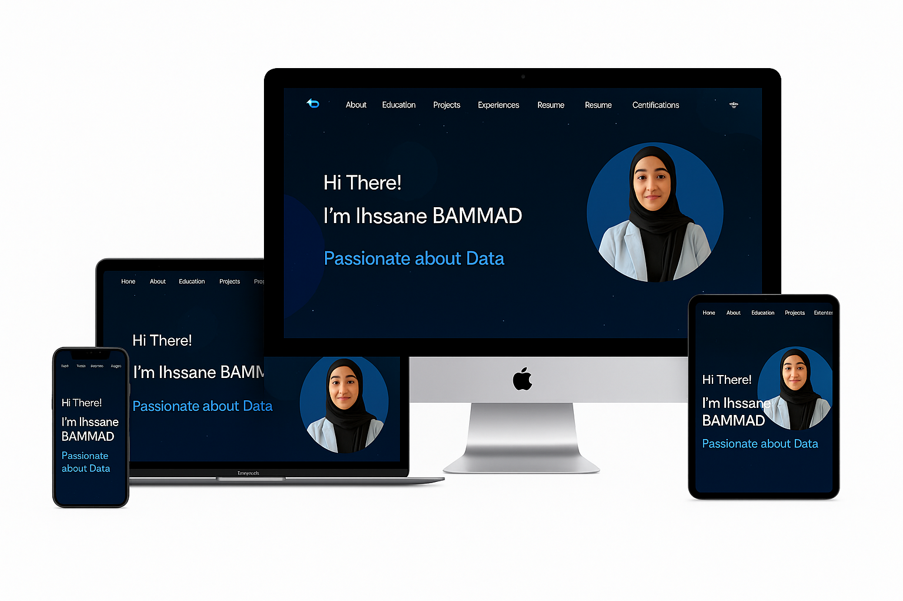

# Ihssane Bammad's Portfolio

## [bammad-portfolio.netlify.app](https://bammad-portfolio.netlify.app/)

## TL;DR

This portfolio is based on a modified version of the work by [Mohammed El Barhichi](https://github.com/elbarhichi/portfolio), which itself is adapted from the original work of [Soumyajit4419](https://github.com/soumyajit4419/Portfolio).  
Feel free to fork and personalize this repository to fit your own needs — just remember to give proper credit to the original creators!

---

## 🛠️ Built With

My personal portfolio [`bammad-portfolio.netlify.app`](https://bammad-portfolio.netlify.app) showcases some of my GitHub projects, resume, technical skills, and experiences in a structured and modern layout.

**Tech Stack:**

-  React.js  
-  Node.js  
-  Express.js  
-  CSS3  
-  VSCode  
-  Vercel (for deployment)

---

##  Features

- 📖 Multi-Page Layout
- 🎨 Styled with React-Bootstrap and CSS — easily customizable
- 📱 Fully Responsive design for mobile and desktop
- 🌙 Dark themed and clean UI
- 📎 Modular and scalable component structure

---

##  Getting Started

Clone down this repository. You will need node.js and git installed globally on your machine.

##  Installation and Setup Instructions
Installation: npm install

In the project directory, you can run: npm start

Runs the app in the development mode.
Open http://localhost:3000 to view it in the browser. The page will reload if you make edits.

##  Usage Instructions
Open the project folder and Navigate to /src/components/.
You will find all the components used and you can edit your information accordingly.
